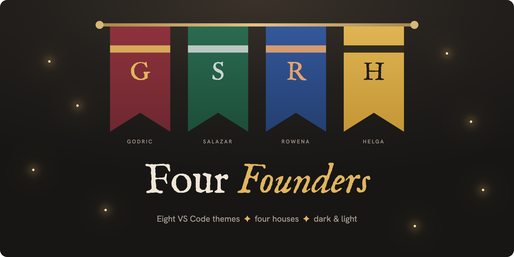
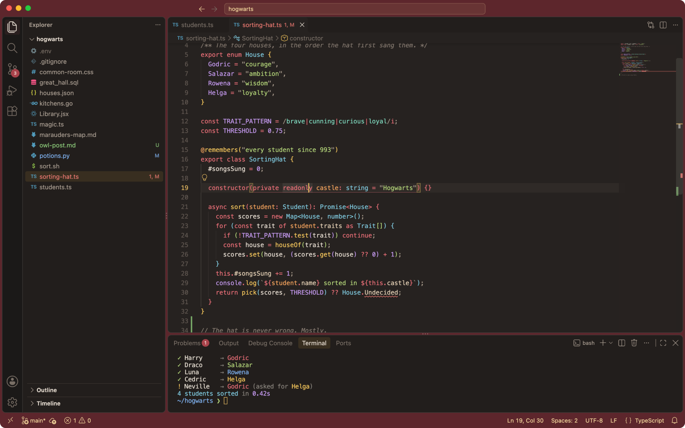
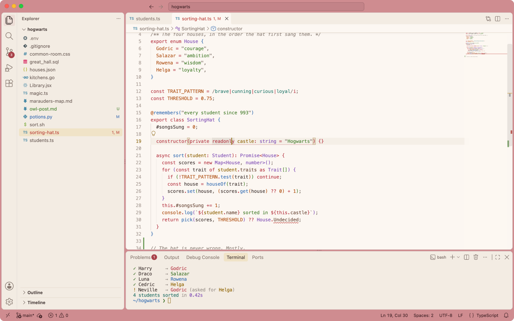
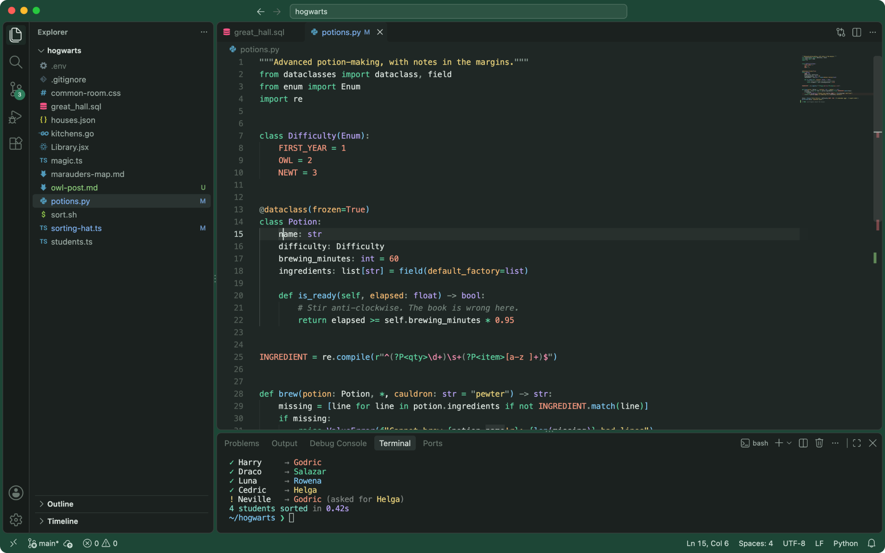
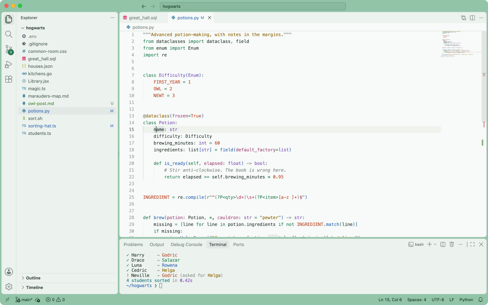
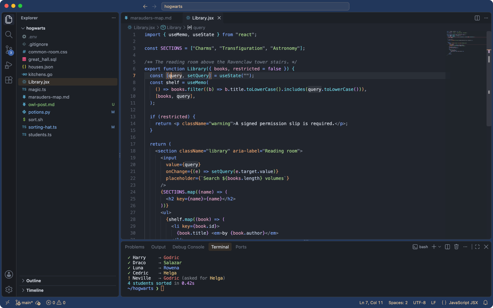
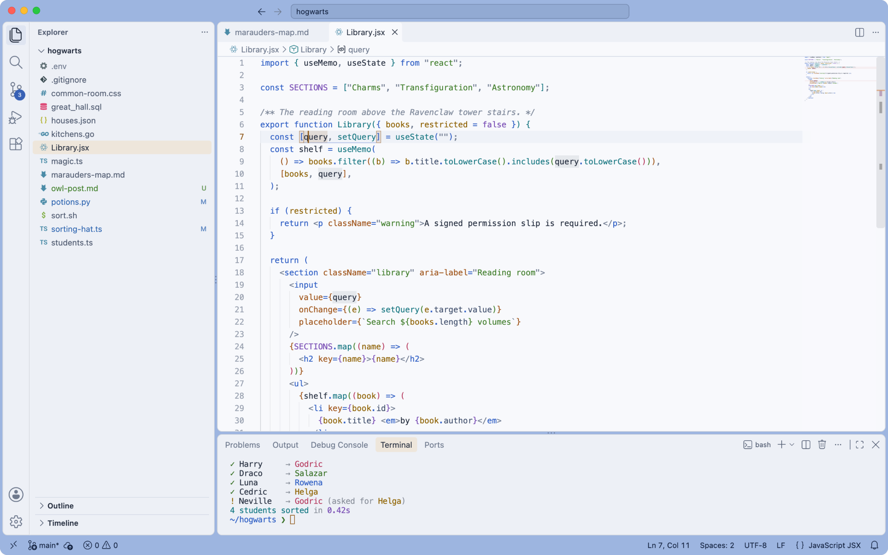
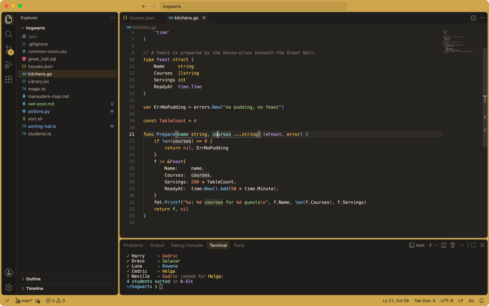
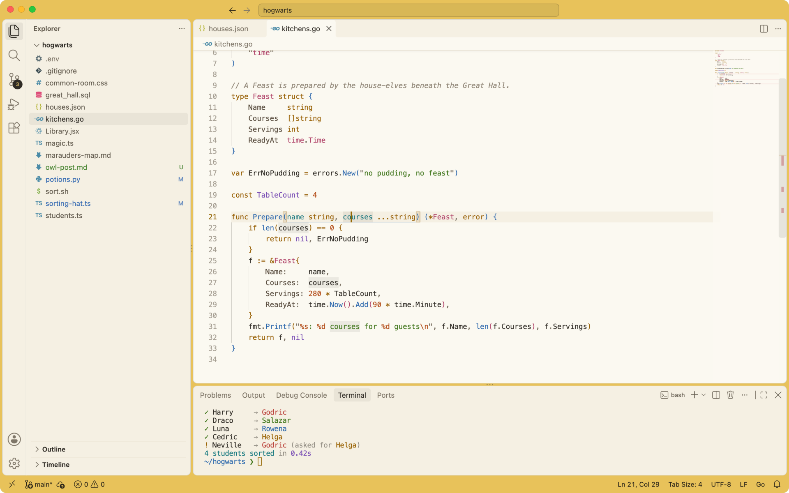
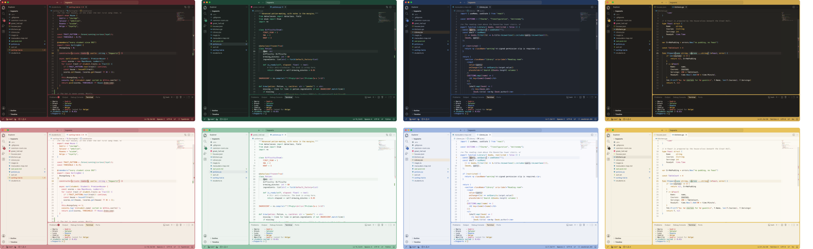

<p align="center">
  
</p>

<p align="center">
  <b>Choose your founder.</b><br>
  Eight VS Code themes, four houses in dark and light, for people who live in their editor and still reread the books.
</p>

<p align="center">
  <a href="https://marketplace.visualstudio.com/items?itemName=prudhvicharan.four-founders"></a>
  
  <a href="https://github.com/Prudhvicharan/four-founders/blob/main/LICENSE"></a>
</p>

---

## The story

I spend most of my day inside VS Code. Somewhere along the way I realised I'd been coding in borrowed colors for years: themes that were pitch black at midnight, paper white at noon, or so neon they felt like a nightclub.

I'm also, unapologetically, a Harry Potter fan. What stayed with me from the books wasn't the spells. It was the common rooms: a fire in the grate, house banners over the door, and the feeling that a place was *yours*.

So I asked myself one question:

> **What if my editor felt like my common room?**

I didn't want a costume, so there are no lightning bolts, giant crests or wallpaper wizards. The house colors hang where banners belong, across the top and bottom of the window, and the code is painted in colors you can read for eight hours straight.

Four founders, four houses, eight themes. Pick yours.

---

## Meet the founders

### 🦁 Godric: for the brave
*Inspired by Gryffindor.* A wine-red banner, gold highlights, and keywords with a little fire in them.

<table>
  <tr>
    <td width="50%"></td>
    <td width="50%"></td>
  </tr>
  <tr><td align="center"><sub><b>Godric Dark</b></sub></td><td align="center"><sub><b>Godric Light</b></sub></td></tr>
</table>

### 🐍 Salazar: for the ambitious
*Inspired by Slytherin.* A deep emerald banner and silver highlights. Sleek, cool and quietly confident.

<table>
  <tr>
    <td width="50%"></td>
    <td width="50%"></td>
  </tr>
  <tr><td align="center"><sub><b>Salazar Dark</b></sub></td><td align="center"><sub><b>Salazar Light</b></sub></td></tr>
</table>

### 🦅 Rowena: for the curious
*Inspired by Ravenclaw.* A midnight sapphire banner and bronze highlights, made for the person with forty tabs of documentation open.

<table>
  <tr>
    <td width="50%"></td>
    <td width="50%"></td>
  </tr>
  <tr><td align="center"><sub><b>Rowena Dark</b></sub></td><td align="center"><sub><b>Rowena Light</b></sub></td></tr>
</table>

### 🦡 Helga: for the loyal
*Inspired by Hufflepuff.* A honey banner with black accents. Warm and friendly, and still there for you at 2 a.m.

<table>
  <tr>
    <td width="50%"></td>
    <td width="50%"></td>
  </tr>
  <tr><td align="center"><sub><b>Helga Dark</b></sub></td><td align="center"><sub><b>Helga Light</b></sub></td></tr>
</table>

---

## Not sure which house? Let the hat decide

| If you… | Your founder |
|---|---|
| push to `main` on a Friday afternoon and sleep just fine | 🦁 **Godric** |
| have a five-year roadmap for your side project, and it's on schedule | 🐍 **Salazar** |
| read the RFC before the tutorial, and the source before the RFC | 🦅 **Rowena** |
| review everyone's pull requests and remember their birthdays | 🦡 **Helga** |

---

## Install

1. Open **Extensions** (`Ctrl+Shift+X` / `Cmd+Shift+X`) and search for **Four Founders**.
2. Click **Install**.
3. Open **Preferences: Color Theme** (`Ctrl+K Ctrl+T` / `Cmd+K Cmd+T`) and choose your house.

Or from a terminal:

```bash
code --install-extension prudhvicharan.four-founders
```

### Follow the sun

To let VS Code switch between your house's dark and light themes with your system:

```jsonc
{
  "window.autoDetectColorScheme": true,
  "workbench.preferredDarkColorTheme": "Four Founders Salazar Dark",
  "workbench.preferredLightColorTheme": "Four Founders Salazar Light",
  "editor.bracketPairColorization.enabled": true,
  "editor.semanticHighlighting.enabled": true
}
```

---

## House rules

These are the rules I held myself to while designing these themes.

- **Banners, not costumes.** Each house frames the window with its banner color on the title bar and status bar. Selected items get a solid highlight in the house's second color: gold, silver, bronze or black.
- **No pitch black, no paper white.** Dark themes sit on soft charcoal. Light themes sit on ivory, mint or cream.
- **Colors you can tell apart.** Keywords, functions, strings, types and numbers each get their own clearly different color, and each house has its own mix.
- **Readable, and checked.** Every code color passes WCAG AA contrast (4.5:1) on the editor background and on the current-line highlight. The build fails if one doesn't.
- **Nothing fake.** Every screenshot here is real VS Code running the published theme, opened on a small Hogwarts-flavored project that lives in [`showcase/`](showcase). What you see is what you install.

Everything is themed: syntax and semantic highlighting, terminal colors, Git decorations and diffs, IntelliSense, hovers, peek views, the command palette, the debugger, test results, the minimap and bracket pairs.

<p align="center">
  
</p>

---

## Build it yourself

All eight themes are generated from one palette file, so they stay consistent with each other.

```bash
git clone https://github.com/Prudhvicharan/four-founders.git
cd four-founders
npm run build      # regenerates themes/ and runs the contrast audit
```

Press **F5** in VS Code to open a window with the themes loaded.

| File | What it does |
|---|---|
| `src/palettes.js` | The colors for every house. Start here. |
| `src/theme.js` | Maps a palette onto every surface VS Code exposes. |
| `scripts/build.js` | Writes `themes/*.json`, syncs `package.json` and audits contrast. |
| `showcase/` | The sample project used for the screenshots. Open it to test every language at once. |

Found a token that looks off? Run **Developer: Inspect Editor Tokens and Scopes** on it and [open an issue](https://github.com/Prudhvicharan/four-founders/issues) with a screenshot. Pull requests are welcome.

---

## Mischief managed

MIT © 2026 Sai Prudhvi Charan Pothumsetty

Four Founders is an unofficial fan project. Harry Potter and all related names are trademarks of Warner Bros. Entertainment Inc. This project is not affiliated with or endorsed by Warner Bros., J.K. Rowling or any of their partners.

<p align="center"><sub>Made in my own common room by a VS Code user still waiting for a Hogwarts letter.</sub></p>
